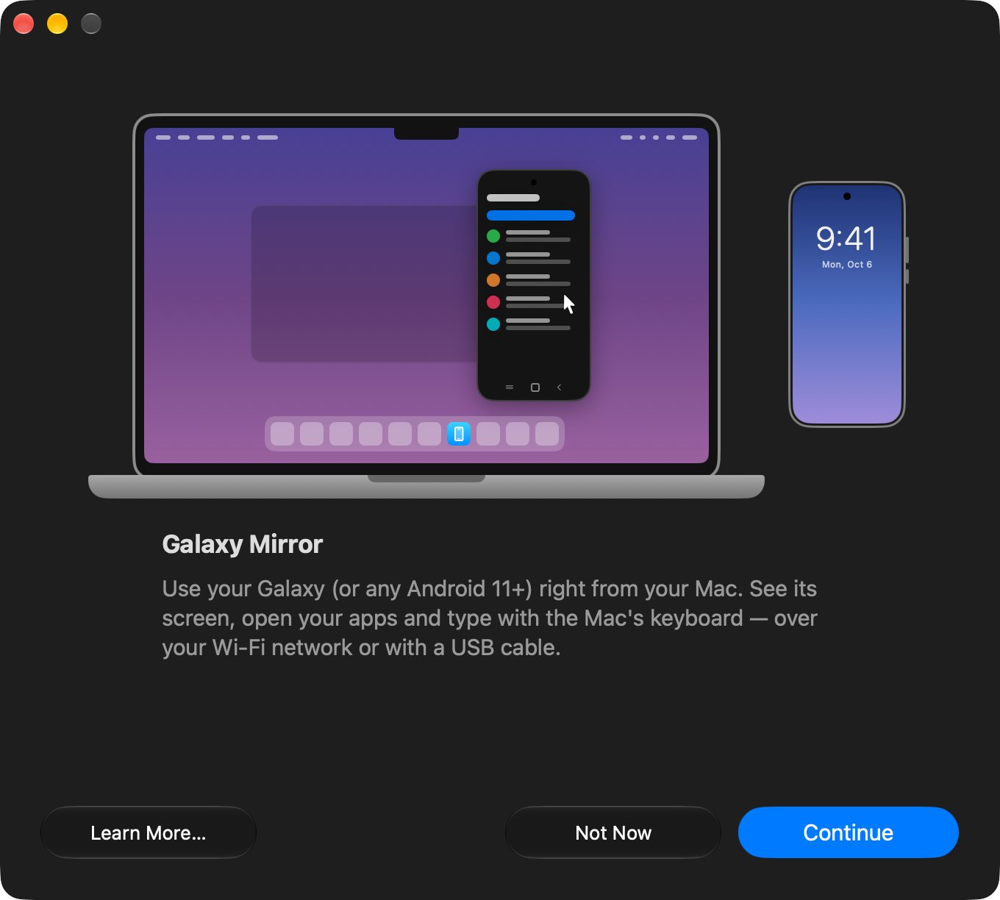

# Galaxy Mirror

Mirror and control a Samsung Galaxy phone (or any Android 11+) on macOS, over Wi-Fi or a USB cable — with a guided setup in the style of iPhone Mirroring.

The app takes care of pairing (with a QR code or a six-digit code), connecting over Wi-Fi or a USB cable, and reconnecting automatically. Mirroring is native: the app sends the [scrcpy](https://github.com/Genymobile/scrcpy) server (pinned version, 5.0) to the phone, receives video and audio through its protocol and shows everything in its own window, with hardware decoding (VideoToolbox) and control with the mouse, trackpad and keyboard.

<p align="center">
  
</p>

## Requirements

- macOS 14 or later
- A phone with Android 11+ on the same Wi-Fi network as the Mac (or connected with a USB cable)

The app already includes `adb` and the scrcpy server; there is nothing else to install.

## Languages

| | Language |
|---|---|
| 🇺🇸 | English |
| 🇧🇷 | Brazilian Portuguese |

The app follows the macOS language; any other language falls back to English.

## Tested devices

So far, the app has only been tested with the following phones:

| Phone | Android |
| --- | --- |
| Galaxy S25 | 16 |
| Galaxy A05s | 15 |
| Galaxy A54 | 16 |

Other devices with Android 11 or later should work, but have not been tested. If you use the app with another model, let us know how it went by opening an issue.

## Install

1. Download `Galaxy-Mirror.dmg` from the latest version on the [Releases page](https://github.com/julianamarques/galaxy-mirror/releases).
2. Open the file and drag **Galaxy Mirror** to **Applications**.

The app tells you when a new version is out. **Galaxy Mirror › Check for Updates…** checks right away, and **Settings › Updates** chooses whether checks are automatic (when the app opens and once a day) or manual only.

The app is only signed locally. On another Mac, macOS blocks the first launch saying it cannot verify the developer: allow it in **System Settings › Privacy & Security › Open Anyway**.

## Build

```bash
./scripts/build-app.sh          # builds build/Galaxy Mirror.app
./scripts/make-dmg.sh           # builds build/Galaxy Mirror.dmg
```

To publish a new version on GitHub (requires a logged-in `gh`):

```bash
DRY_RUN=1 ./scripts/release.sh 0.2.0-beta.1   # shows the notes without changing anything
./scripts/release.sh 0.2.0-beta.1             # pre-release (alpha, beta or rc)
./scripts/release.sh 1.0.0                    # stable version
```

The build scripts download `adb` (`scripts/fetch-adb.sh`, platform-tools 37.0.1) and the scrcpy server (`scripts/fetch-server.sh`) and check their checksums.

For development, `swift run` also works, and `swift test` runs the tests. In debug builds, `GALAXY_STEP=pair` (or `prepare`, `code`, `connecting`, `failed`, `done`, `missing`) opens straight into a setup step.

## Translations

Strings are written in Portuguese in the code, and the translations live in `Resources/Localizable.xcstrings` (a String Catalog, which can be edited in Xcode). The Local Network permission text lives in `Resources/InfoPlist.xcstrings`. After adding or changing strings, run:

```bash
./scripts/sync-strings.sh   # extracts the strings from the code and updates the catalog
```

New strings show up untranslated in the catalog, and `swift test` fails until every one has an English version with the same placeholders (`%@`, `%lld`) as the original.

## Structure

```
Sources/GalaxyMirror/
├── App/          entry point (GalaxyMirrorApp, AppDelegate)
├── Models/       data types (PairedDevice, MDNSService, Quality, Codec, SettingsKey…)
├── Services/     adb integration (ADB, Bonjour, LocalNetwork, Tools)
│   └── Mirror/   native client for the scrcpy protocol (server, sockets, video, audio, control)
├── ViewModels/   observable state (AppModel, SetupModel)
├── Views/        SwiftUI screens (Setup, Device, Settings), mirror window (Mirror) and components
└── Extensions/   extensions to system types
Tests/GalaxyMirrorTests/
Resources/        Info.plist, icon, translations (.xcstrings), scrcpy-server and adb (downloaded and checksummed by the scripts)
scripts/          .app and .dmg builds, server and adb downloads, icon generation and string extraction
```

## How it works

1. **Prepare the Galaxy** — turn on Developer options and Wireless debugging.
2. **Pair** — the app shows a QR code in the same format as Android Studio (`WIFI:T:ADB;S:<name>;P:<password>;;`). When it is scanned, the phone advertises `_adb-tls-pairing._tcp` over mDNS and the app runs `adb pair`.
3. **Connect** — the app waits for the phone's `_adb-tls-connect._tcp` service and runs `adb connect`. The device identifier is saved so it can reconnect automatically, even when the port changes.
4. **USB cable (alternative)** — without a shared Wi-Fi network, the app also connects over the cable with USB debugging. A Galaxy paired over Wi-Fi switches to the cable automatically when it is plugged in.
5. **Mirror** — the app sends the server to the phone, opens the video, audio and control sockets through an adb tunnel and shows the video in its own window. Click and drag to touch, scroll with the trackpad, type with the keyboard (accents included), right-click to go back and use the Back, Home and Recents buttons in the title bar. The clipboard is synced both ways (⌘V pastes on the phone).
6. **Reconnect** — if the connection drops while in use, the window stays open with a "Reconnecting…" notice and the app tries again for up to 30 seconds, including switching from the cable to Wi-Fi. While the app is open, the status shows in real time whether the phone is on the cable, on Wi-Fi or disconnected.

## Limitations

- Wireless debugging requires the Mac and the phone to be on the same Wi-Fi network; it does not work over the phone's own hotspot (the app detects this and suggests the USB cable).
- Android's Wireless debugging may turn off after the phone restarts or changes networks. The pairing stays valid: just turn it back on on the phone or connect the USB cable once, and the app turns it on by itself.
- Apps with protected content (banking, streaming) show a black screen.

## Contributing

Fixes and improvements are welcome. See the [contribution guide](CONTRIBUTING.md). To report vulnerabilities, follow the [security policy](SECURITY.md).

## License

Galaxy Mirror is distributed under the [Apache 2.0 license](LICENSE). Credits and third-party licenses are in [NOTICE](NOTICE) and ship with the app in `Contents/Resources/`.

## Credits

The Android robot in the icon is reproduced or modified from work created and shared by Google and used according to terms described in the [Creative Commons 3.0 Attribution License](https://creativecommons.org/licenses/by/3.0/). The mirroring server is [scrcpy](https://github.com/Genymobile/scrcpy)'s, by Genymobile, under the Apache 2.0 license. The `adb` included in the app is Google's, from the Android SDK Platform-Tools; its license notices ship in `Contents/Resources/adb-NOTICE.txt`.
